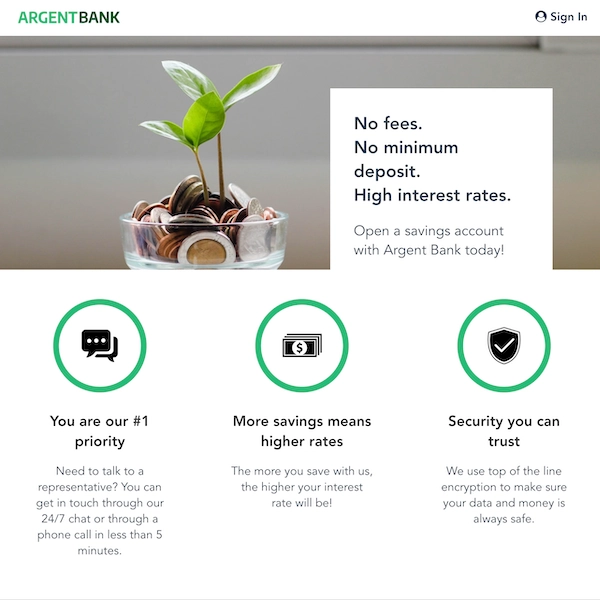

## Argent Bank - Projet de soutenance n°11 de la formation Développeur Intégrateur Web

Dans ce projet, j'ai développé le front-end d'une application bancaire en utilisant React et Redux pour une expérience utilisateur dynamique et réactive. J'ai intégré le front-end avec le back-end via des appels API REST et utilisé Swagger pour définir les points d'accès de l'API. J'ai également utilisé Node.js pour gérer le code côté serveur, renforçant ainsi mes compétences en matière d'applications full-stack.

## Les technologies utilisées

- HTML 5
- CSS 3
- JavaScript
- React.js
- Redux
- API REST (Swagger)